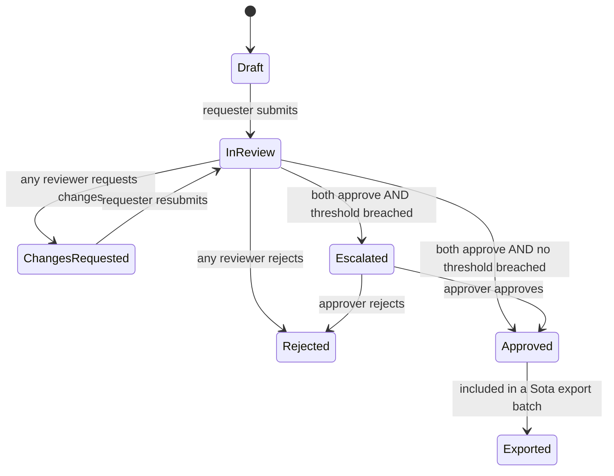

# BRD — VNPL Partner Onboarding & Review Tool (Interim)

| Field | Value |
|---|---|
| Version | 0.4 (build baseline) |
| Date | 2026-09-23 |
| Owner | Quang — Head of IT/Digital |
| Status | Approved for build — Sota import fields (Q1) needed before Week 2 (§15) |
| Lifespan | **Interim, ~8–11 weeks.** Retired when Polaris CRM (clients **and** vendors) goes live (§11) |

**Change log**

| Version | Change |
|---|---|
| v0.4 | Scope cut for an ~8–11 week life. Built on Django; the Django admin is the UI. FMS confirmed as **Sota**; export is CSV only. Removed: email notifications, the Suspended state, the separate InReview state, cloning, admin-editable thresholds/mapping/reference lists (now config), `polaris_account_id`, and the Legal go-live gate. Vendors also move to Polaris. Added a 2-week plan (§15). |
| v0.3 | Expanded §1 into a full situation summary: programme context, systems landscape, infrastructure status, problem statement, and how each constraint shapes the design. No requirement changes. |
| v0.2 | Removed Microsoft 365 SSO; the tool now uses simple local accounts. Removed client cadence data. The FMS export now covers approved **clients and vendors**, each with its salesperson. Scope trimmed to interim-only because Polaris CRM is the long-term home for client onboarding. |
| v0.1 | Initial draft. |

Legend: **[Fact]** confirmed · **[Assumption]** to confirm · **[Decision needed]** blocks part of the build.

---

## 1. Summary & Situation

### 1.1 In one paragraph
VNPL is standardizing its finance data and building internal finance modules, but the server to host them is not yet in place, and Polaris CRM, the future home of client onboarding, is still being built. In the meantime, new clients and vendors still need a finance and legal gate before ops can use them in the FMS. This tool fills that gap: small, temporary, and designed to be retired into Polaris.

### 1.2 Business context
- VNPL (Vietnam Post Logistics) is the logistics subsidiary of VNPost, with ~225 staff. **[Fact]**
- Business units include Logistics Nội địa, TMĐT Quốc tế, Trung tâm Kho vận, XNK, and Logistics Quốc tế (TP.HCM). **[Fact]**
- The forwarding sales team brings in new clients. Ops and procurement bring in new vendors: carriers, co-loaders, overseas agents, truckers, customs brokers, and warehouses. **[Fact]**
- Ops run day-to-day operations in the FMS, where every client and vendor must exist with its assigned salesperson. **[Fact]**

### 1.3 The wider programme this tool sits inside
VNPL is running a phased finance data programme:

| Phase | Focus |
|---|---|
| Phase 0 | Standard chart of accounts and dimension dictionary: site, business line, client, cost center, contract |
| Phase 1 | Consolidated reporting layer |
| Phase 2 | Pilot on one business line |
| Phase 3 | Evidence-based platform decision |

**[Fact]**

The programme's baseline assessment documented these problems across units. **[Fact]**
- There are no shared customer or service master codes.
- Pass-through funds (thu hộ / chi hộ) are not separated from revenue in any system.
- Receivables are tracked in duplicate.
- Reporting is almost entirely manual.

**Two-layer architecture.** Official accounting books are kept in the Head Corp–mandated system (Lớp 1). Data is submitted upward through a bridge layer (Lớp cầu nối). VNPL's own operational and management layer (Lớp 2) is VNPL's to design. **This tool lives entirely in Lớp 2.** It does not post accounting entries and does not replace any Head Corp system. **[Fact]**

### 1.4 Systems landscape

| System | Role | Status | Relationship to this tool |
|---|---|---|---|
| Head Corp accounting system | Official books (Lớp 1) | Live, mandated | None. This tool never writes to it |
| Internal finance & HR-lite modules | Revenue, receivables, basic HR records (Lớp 2) | In build; awaiting a production server | Future consumer of the approved partner master |
| Polaris CRM (on M365) | Client accounts, sales pipeline | In build | **Successor.** Client onboarding moves here; this tool retires |
| FMS | Operational system for ops | Live | Receives exported approved clients and vendors |
| SharePoint | Document storage and governance | Live | Holds all onboarding documents; this tool stores links only |

### 1.5 Infrastructure situation
- IT/Digital has asked leadership to request an on-premise server at Head Corp's facility, with DevOps support. It would host the internal finance and HR-lite modules and their databases for security and compliance. **[Fact]**
- If Head Corp cannot support this, VNPL will rent an external server. **[Fact]**
- Until either is available there is no VNPL production hosting. The interim tool therefore runs on Render (app) and Neon (PostgreSQL), holding minimal data (§10). **[Fact — decision]**

### 1.6 The problem this tool solves
- New clients and vendors need a recorded finance and legal review before ops can transact with them. **[Fact]**
- Today, intake from forwarding sales is not standardized, and review evidence is scattered. **[Assumption — confirm current channel: email / Zalo / Excel]**
- Approved partners are re-keyed into the FMS by hand. The salesperson link is sometimes missing or wrong. **[Assumption — confirm]**
- Waiting for Polaris would leave this gap open for months. Building the full onboarding flow now would duplicate Polaris. **[Inference]**

### 1.7 Solution
A small web app that does three things:
1. **Standardized intake** for new clients (from forwarding sales) and new vendors.
2. **Parallel Finance and Legal review**, with escalation, a request-changes loop, and an append-only audit trail.
3. **FMS export** of approved clients and vendors, each with its assigned salesperson and FMS sales code, in files that import directly into the FMS.

It is **not** a CRM. There is no pipeline, no quotations, no activities, and no customer operating data.

### 1.8 How the situation shapes the design

| Situation | Design consequence |
|---|---|
| Polaris will own client and vendor onboarding in ~8–11 weeks | Minimal scope; the Django admin is the UI; hand-over by CSV (§11) |
| No production server yet | Render + Neon now; standard PostgreSQL |
| Data leaves VNPL infrastructure during the interim period | No HR data, bank details, ID numbers, or uploaded files (§10) |
| Interim tool, small user base; M365 SSO needs an app-admin role that is slow to obtain | Local accounts instead of M365 SSO |
| FMS needs the correct owner per partner | Salesperson is separate from the requester and carries an FMS code; rows with missing codes are held back as exceptions |
| No shared client master codes yet (Phase 0 in progress) | `client_code` is nullable and entered manually; the tool never invents a format |
| Pass-through funds are an unresolved finance problem | Thu hộ / chi hộ is flagged at intake so Finance handles it from day one |
| Lớp 1 / Lớp 2 split | The tool never posts accounting entries and does not overlap Head Corp systems |

## 2. Objectives & Success Metrics

| # | Objective | Metric | Target |
|---|---|---|---|
| O1 | No partner reaches ops without a finance + legal decision | % of new clients/vendors in FMS with an approved record in the tool | 100% |
| O2 | Faster, visible reviews | Median working days from submission to final decision | ≤ [3] — **[Decision needed]** |
| O3 | Remove re-keying into FMS | % of exported partners that import into FMS without manual edits, with the correct salesperson | ≥ 95% |
| O4 | Clean master data | Duplicate partners (same tax code) created | 0 |

---

## 3. Scope

### 3.1 In scope — MVP (Must)
- Local user accounts, created by Admin, with in-app roles.
- Client intake form (submitted by forwarding sales), including the assigned salesperson.
- Vendor intake form (carrier, co-loader, overseas agent, trucker, customs broker, warehouse).
- Finance and Legal checklists and decisions (parallel), escalation to an approver, and a "request changes" loop.
- State machine, comments, and an append-only audit log.
- Sota export of approved clients and approved vendors (separate CSV files), including salesperson, with a pre-export validation step and an export log.
- Simple queues: "My requests", "Awaiting my review", and "Ready to export".
- Admin (via the Django admin): users & roles, salesperson list (with Sota codes). Thresholds, export mapping, and reference lists live in config, and IT changes them.

### 3.2 Should
None.

### 3.3 Out of scope (explicit)
- Microsoft 365 / Entra ID SSO.
- Email or other notifications. Users check their queues.
- A custom-designed UI. The Django admin, localized to Vietnamese, is the UI.
- Admin screens for thresholds, export mapping, or reference lists.
- Client cadence or operating data (lanes, frequency, volume).
- CRM functions: leads, opportunities, quotations, activities. These belong to Polaris.
- Invoicing, accounts receivable, accounts payable, payments, and the general ledger.
- HR or employee data.
- Storing bank account numbers, ID/passport numbers, or uploaded files. Documents stay in SharePoint; the tool stores links only.
- Direct FMS API integration. The tool exports files only.
- Automated tax-portal, credit, or sanctions lookups. Reviewers check manually and record an evidence link.
- Dashboards and analytics beyond the queues listed in 3.1.

---

## 4. Users & Roles

| Role | Who | Can do |
|---|---|---|
| Requester – Sales | Forwarding sales team | Create/edit own client drafts, submit, respond to change requests |
| Requester – Procurement/Ops | Ops / procurement staff | Create/edit own vendor drafts, submit, respond to change requests |
| Finance Reviewer | Finance (TCKH) | Finance checklist; approve / approve with conditions / request changes / reject |
| Legal Reviewer | Legal / admin-legal | Legal checklist; same decisions as Finance |
| Approver | Board member / delegated manager | Decide escalated requests |
| Ops Exporter | Ops coordinator | Generate FMS export files for approved clients and vendors |
| Admin | IT/Digital | Users, roles, salesperson list, reference lists, thresholds, export mapping |

A user may hold several roles. A user MUST NOT review their own request.

**Salesperson vs requester.** The salesperson is a separate field, not the person who submitted the form. An assistant may submit on a salesperson's behalf, and the FMS needs the salesperson, not the typist.

---

## 5. Process & States

Rules:
- Finance and Legal reviews run **in parallel**. Both must be "Approve" or "Approve with conditions" to advance.
- "Approve with conditions" requires a conditions text, which is included in the export.
- **Escalation triggers** (set in config): requested credit limit above [X] VND; payment terms longer than [N] days; Legal flags a contract deviation. **[Decision needed: X, N]**
- On resubmission, earlier review decisions reset. Earlier comments and checklist answers stay visible.
- Rejected requests are read-only.
- A user MUST NOT act as Approver on their own request.
- A salesperson change after approval requires Finance acknowledgement, is audit-logged, and marks the partner "changed since last export".

---

## 6. Functional Requirements

| ID | Requirement | Priority |
|---|---|---|
| FR-01 | Local accounts: Admin creates users with a temporary password; the user must change it on first login. Passwords hashed with Argon2. Account locks for 15 minutes after 5 failed attempts. Session expires after 60 minutes idle. Password reset by Admin only (no self-service email flow). | Must |
| FR-02 | Client intake form (§7.2): save draft, submit, field validation with Vietnamese messages. Salesperson is required and chosen from the active salesperson list. | Must |
| FR-03 | Vendor intake form (§7.3). Salesperson is optional **[Decision needed: Q4]**. | Must |
| FR-04 | Tax code (MST) format validation: 10 digits, or 10 digits + "-" + 3 digits for branches. Foreign vendors use a foreign registration number instead. | Must |
| FR-05 | Duplicate check on MST and normalized legal name. Warn on submit and show matches; proceeding requires a justification comment. | Must |
| FR-06 | Finance checklist (§7.4) and decision; a comment is mandatory for any non-approve outcome. | Must |
| FR-07 | Legal checklist (§7.5) and decision; same rules. | Must |
| FR-08 | State machine exactly as §5; invalid transitions rejected server-side. | Must |
| FR-09 | Automatic escalation using thresholds from config. | Must |
| FR-10 | Append-only audit log: who, when, action, before/after values for every state change and every post-submission edit. | Must |
| FR-11 | Comment thread per request. | Must |
| FR-12 | Sota export (§8): separate client and vendor CSV files (UTF-8 with BOM), columns driven by a per-type mapping in config. | Must |
| FR-13 | Pre-export validation: records missing a required FMS field (e.g. a salesperson without an FMS code) are **excluded and listed as exceptions with the reason**. They are never exported half-filled. | Must |
| FR-14 | Export log: batch ID, file name, type, generated by, timestamp, and the record IDs included. Records show last-exported time and a "changed since last export" flag. | Must |
| FR-15 | Queues: "My requests", "Awaiting my review", "Ready to export", filterable by type, state, and salesperson. | Must |
| FR-16 | Django admin: users & roles; salesperson list (name, email, Sota sales code, active). | Must |
| FR-17 | Client code: nullable, entered manually by Finance. The tool MUST NOT generate a code format of its own. | Must |

---

## 7. Data Model (logical)

### 7.1 Entities
- `partner_request`: id, request_no (`REQ-2026-0001`), type (`client` | `vendor`), state, requester_id, created_at, submitted_at, decided_at, version
- `partner`: id, type, legal_name, legal_name_normalized, mst, foreign_reg_no, address, country, partner_subtype, client_code (nullable), sales_rep_id (required for clients), status, last_exported_at, changed_since_export, source_request_id
- `sales_rep`: id, full_name, email, fms_sales_code (nullable until Admin fills it), active
- `contact`: id, partner_id, name, role_title, email, phone. Business contacts only; keep to the minimum.
- `review`: id, request_id, review_type (`finance` | `legal` | `approver`), reviewer_id, decision, conditions_text, comment, checklist_json, decided_at
- `comment`, `audit_log` (append-only), `export_batch`, `export_item`, `export_exception`, Users and roles use Django's built-in user and group tables, plus must_change_password, failed_attempts, and locked_until. Reference values (vendor types, services, currencies) are fixed choices in code.

### 7.2 Client intake fields
Legal name · MST · registered address · invoice details (invoice name, address, e-invoice email) · business contact(s) · **salesperson** · requested payment terms (days) · requested credit limit (VND) · expected monthly revenue (VND) · billing currency · **thu hộ / chi hộ expected (Y/N + description)** · service scope (freight, customs, trucking, warehousing) · business registration link (SharePoint) · proposed contract/quotation link (SharePoint) · notes.

### 7.3 Vendor intake fields
Legal name · MST or foreign registration no. · country · vendor type · services covered · payment terms offered · billing currency · licences/permits link · insurance certificate link · rate agreement link · contact(s) · requesting department · salesperson (optional) · notes. **No bank account numbers.**

### 7.4 Finance checklist (Yes / No / N/A + optional evidence link)
MST verified active on the tax portal · invoice details complete · payment terms within policy · credit limit justified by expected revenue · prepayment/deposit required · thu hộ/chi hộ handling agreed · currency terms clear.

### 7.5 Legal checklist
Business registration verified · signatory authority verified · standard contract used (if No: deviation summary) · liability/insurance terms acceptable · commodity not restricted (or handled) · restricted-party screening done (evidence link) · NDA required.

---

## 8. FMS Export (Sota)

- **FMS:** Sota. **[Fact]**
- **Files:** one client CSV and one vendor CSV (UTF-8 with BOM) per batch. Sota customer and vendor imports are assumed to be separate templates **[Assumption — confirm in Q1]**.
- **Mapping:** a per-type config file (`config/fms_mapping.yaml`, changed by IT) sets Sota column headers, order, required flags, and value translations.
- **Default client columns until the Sota fields are known:** client_code, legal_name, mst, address, invoice_name, invoice_email, payment_terms_days, credit_limit_vnd, billing_currency, conditions_text, **sales_rep_name, sales_rep_fms_code**, primary_contact_name, primary_contact_email, primary_contact_phone, request_no, approved_at.
- **Default vendor columns:** legal_name, mst_or_foreign_reg, country, vendor_type, payment_terms_days, billing_currency, conditions_text, sales_rep_name, sales_rep_fms_code, primary_contact_name, primary_contact_email, primary_contact_phone, request_no, approved_at.
- **Selection:** new approvals not yet exported (default), changed since last export, or manually selected records.
- **Validation (FR-13):** any row missing a mapping-required field goes to the exceptions list shown on screen and saved in `export_exception`. The rest of the batch still exports.
- **[Decision needed — Q1]:** Sota's required customer and vendor import fields, and how it identifies salespersons (code, username, or email).

---

## 9. Non-Functional Requirements

| Area | Requirement |
|---|---|
| Users / load | ~[30] named users, <10 concurrent **[Assumption]**; p95 page response < 2 s |
| Security | Local accounts per FR-01; RBAC enforced server-side on every route; CSRF protection; secure, HTTP-only cookies; HTTPS only; secrets only in environment variables |
| Audit | Audit log append-only; no hard deletes of requests, reviews, partners, or audit rows |
| Localization | Vietnamese UI; timestamps stored UTC, displayed Asia/Ho_Chi_Minh; VND with thousand separators, no decimals |
| Hosting | Render **paid** web instance (the free tier sleeps), Singapore region; Neon PostgreSQL in AWS ap-southeast-1. Confirm both region options at setup |
| Backup | Neon point-in-time restore |
| Stack | Python + Django (the admin is the UI); Django migrations; standard PostgreSQL; no Render- or Neon-specific code |

---

## 10. Data-Handling Constraints

The data sits outside VNPL infrastructure during the interim period. The tool therefore holds business partner data and minimal business contacts only: no HR data, no bank details, no ID numbers, and no uploaded documents. Legal's role is limited to the Legal Reviewer role in the tool; there is no separate go-live sign-off.

---

## 11. Retirement Path (Polaris)

- **Successor:** Polaris CRM, for both clients and vendors. It is expected in 8–10 weeks, plus 1 week for API deployment. **[Fact]**
- **Hand-over:** partner, contact, and salesperson data exported as CSV, reusing the export feature.
- **Sunset:** when Polaris goes live, all users become view-only. After 90 days the database is archived with `pg_dump`, and the Render and Neon services are deleted.

---

## 12. Open Questions

| # | Question | Suggested owner | Blocks |
|---|---|---|---|
| Q1 | Sota's required customer and vendor import fields, and how it identifies salespersons | Ops lead | Export mapping (Week 2) |
| Q2 | Escalation thresholds X (VND) and N (days) | Finance (TCKH) | Values only; build uses placeholders |
| Q3 | Who holds the Legal Reviewer role? | BGĐ | UAT |
| Q4 | Do vendors need a salesperson in the FMS? | Ops / Sales lead | Vendor required fields |
| Q5 | Review turnaround target | BGĐ | KPI |

---

## 13. Risks

| Risk | Mitigation |
|---|---|
| Interim tool outlives its purpose | Sunset tied to the Polaris go-live (§11); scope kept lean |
| Salesperson codes don't match FMS | Salesperson list holds the FMS code; pre-export validation blocks mismatches |
| FMS template unknown | Configurable mapping; confirm Q1 before M5 |
| Local passwords weaker than SSO | Argon2, lockout, idle timeout, admin-only reset; small user base |
| Single-developer dependency | CLAUDE.md, README, and tests |
| Polaris slips past 11 weeks | The tool keeps running; there is nothing to extend unless a real gap appears |

---

## 14. Acceptance Criteria (UAT)

1. A new user logs in with a temporary password and is forced to set a new one. Five wrong attempts lock the account.
2. A sales user submits a client with an invalid MST and is blocked with a Vietnamese error message.
3. A client whose MST already exists triggers a duplicate warning and needs a justification to proceed.
4. Finance approves and Legal requests changes → ChangesRequested. The requester resubmits → both reviews reset.
5. Both approve with a credit limit above the threshold → Escalated. The approver approves → Approved.
6. A reviewer cannot review their own request (hidden in the UI and rejected by the API).
7. Two approved clients and one approved vendor are exported. The client file has two rows including salesperson name and FMS code. The vendor file has one row. Both CSVs open in Excel with correct Vietnamese characters. The export log records the batch, and all three records move to Exported.
8. An approved client whose salesperson has no FMS code is excluded from the batch and appears in the exceptions list with the reason.
9. Changing the salesperson on an exported client flags it "changed since last export" and writes an audit entry.
10. Every step above appears in the audit log with user, timestamp, and before/after values.

---

## 15. Plan (2 weeks)

| Week | Deliverable | Done when |
|---|---|---|
| 1 | Django project; data model; login with lockout and forced password change; intake forms with MST and duplicate checks; Finance/Legal review; state machine; escalation; audit log; queues. Deployed to Render + Neon. | UAT items 1–6 and 10 pass on Render |
| 2 | Sota export mapped to the real fields (Q1); exceptions list and export log; salesperson list loaded; users created; UAT with Sales, Finance, Legal, and Ops. | UAT items 7–9 pass; go-live |
